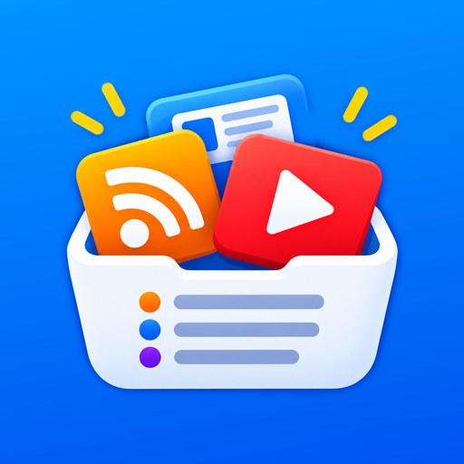

<p align="center"></p>

# FeedVibe

App Android estilo **Podcast Addict** para seguir canales de vídeo y feeds: ves de un vistazo qué episodios
no has visto, los marcas como vistos y todo se **sincroniza al instante entre tus dispositivos** con tu cuenta de Google.

## Funciones

| | |
|---|---|
| **Fuentes** | YouTube (canal, @handle, vídeo o lista), Twitch (directos + vídeos), Dailymotion, Vimeo, Odysee, podcasts (buscador de Apple Podcasts) y cualquier web/blog con RSS/Atom (detecta el feed sola) |
| **Canal entero de YouTube** | Además de los 15 últimos del RSS, botón **«Cargar todos»** para listar todos los vídeos del canal (YouTube Data API) |
| **Novedades** | Episodios sin ver con filtros por plataforma y categoría, búsqueda y *pull to refresh* |
| **Visto / no visto** | Desliza → visto · desliza ← ver más tarde · pulsación larga → visto · "este y anteriores" · "todo el canal" |
| **Sincronización** | Inicio de sesión con Google. Canales, vistos, *ver más tarde*, favoritos, posición de reproducción, apodo y foto se sincronizan **en tiempo real** (Cloud Firestore, también sin conexión) |
| **Periodo de actualización** | Manual, 15 min, 30 min, 1 h, 2 h, 6 h, 12 h o diario · solo Wi-Fi · actualizar al abrir |
| **Notificaciones** | Episodios nuevos con miniatura y botones *Marcar como visto* / *Ver más tarde*; directos; on/off por canal |
| **Copias de seguridad** | Google Drive (manual y automática diaria/semanal/mensual, guarda las N últimas), archivo `.json`, importar/exportar **OPML** |
| **Apariencia** | Tema sistema/claro/oscuro con vista previa, negro AMOLED, Material You, 8 colores de acento, lista en tarjetas o compacta |
| **Perfil** | Foto desde la cámara o la galería (o la de Google), apodo editable y estadísticas |
| **Biblioteca** | Ver más tarde, en curso, favoritos e historial |
| **Reproductor** | Podcasts y audio/vídeo directo en la app (1x–2x, recuerda la posición en todos tus dispositivos). YouTube/Twitch… se abren en su app o en el navegador integrado |
| **Actualizaciones** | Busca versiones nuevas en GitHub Releases, las descarga y las instala **sin salir de la app** |
| **Compartir** | Desde YouTube/Twitch/navegador → *Compartir* → FeedVibe añade el canal |

## Compilar

GitHub Actions compila el APK en cada push (`.github/workflows/android.yml`) y cada push a `main` publica una
Release `v1.0.N` con el APK (así se actualiza la app). En local: Android Studio (JDK 17) → *Run*, o `./gradlew assembleRelease`.

## Inicio de sesión con Google y sincronización (Firebase)

Sin este paso la app funciona igual, pero solo en local.

1. <https://console.firebase.google.com> → **Añadir proyecto**.
2. **Añadir app Android** con el paquete `com.feedvibe.app` y la huella **SHA-1** de la firma
   (`keytool -list -v -keystore keystore/feedvibe-default.jks -storepass feedvibe`, o la de tu propia clave).
3. **Authentication** → *Sign-in method* → activa **Google**.
4. **Firestore Database** → crear (modo producción) y pega las reglas de [`firestore.rules`](firestore.rules).
5. Descarga `google-services.json`: en local cópialo a `app/google-services.json`; para GitHub Actions crea el
   secreto `GOOGLE_SERVICES_JSON` con su contenido (*Settings → Secrets and variables → Actions*).
6. **Google Drive** (copias): en <https://console.cloud.google.com> (mismo proyecto) habilita **Google Drive API** y en la
   *pantalla de consentimiento OAuth* añade el permiso `.../auth/drive.file` y tu cuenta como usuario de prueba.

## Ver todos los vídeos de un canal de YouTube

El RSS público de YouTube solo da los **15 vídeos más recientes**. Para listar el canal entero FeedVibe usa la
**YouTube Data API v3** (gratis, 10.000 unidades/día; cargar 1.000 vídeos gasta unas 40):

1. <https://console.cloud.google.com/apis/library/youtube.googleapis.com> → **Habilitar** (vale el proyecto de Firebase).
2. *Credenciales* → *Crear credenciales* → **Clave de API** (recomendado: restringirla a "YouTube Data API v3").
3. Pégala en la app (**Perfil → Reproducción → YouTube**) o guárdala como secreto `YOUTUBE_API_KEY` en GitHub para
   que vaya incluida en el APK.

Después, cada canal de YouTube muestra **«Cargar todos»** (y al suscribirte puedes cargar el canal entero directamente).
Las actualizaciones periódicas siguen usando el RSS (no gastan cuota). El historial completo se sincroniza: el otro
dispositivo también lo carga.

## Firma de las actualizaciones

Para que una versión se instale encima de la anterior, todas deben ir firmadas con la misma clave. El repo incluye
`keystore/feedvibe-default.jks` para que funcione sin configurar nada. Si prefieres una clave privada (hazlo **antes**
de instalar la app por primera vez: cambiarla obliga a desinstalar):

```bash
keytool -genkeypair -keystore release.jks -alias feedvibe -keyalg RSA -keysize 2048 -validity 10000
base64 -w0 release.jks   # → secreto KEYSTORE_BASE64
```
y crea también `KEYSTORE_PASSWORD`, `KEY_ALIAS` y `KEY_PASSWORD`.

> La app lee las Releases de `guillermorc-gain/FeedVibe` (`UPDATE_REPO` en `app/build.gradle.kts`).
> El repositorio debe ser **público** para que pueda descargarlas sin token.

## Notas técnicas

- Kotlin + Jetpack Compose (Material 3), Room, DataStore, WorkManager, OkHttp, Coil, Media3.
- YouTube: RSS público para las novedades y YouTube Data API para el historial completo. "Ocultar Shorts" usa la
  lista de subidas largas del canal (`UULF…`).
- Twitch usa la API GraphQL pública de su web; Dailymotion su API pública.
- Los identificadores de canales y episodios se calculan igual en todos los dispositivos, así que el estado visto/no
  visto coincide aunque cada móvil descargue los feeds por su cuenta. Ante conflictos gana el cambio más reciente.
- El icono se genera con `tools/make_icon.py`: fondo azul a sangre y dibujos dentro de la zona segura del icono
  adaptativo, para que ningún launcher (círculo, squircle, gota…) los recorte.
